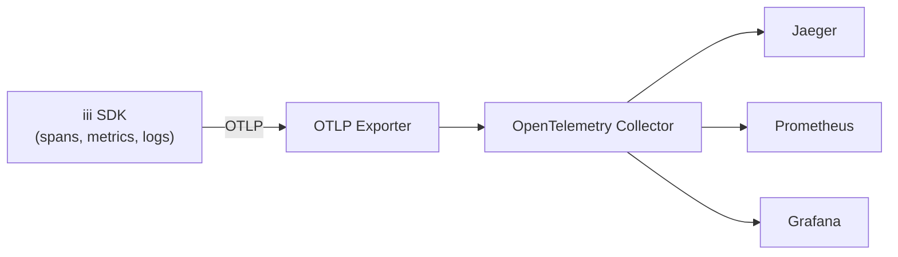
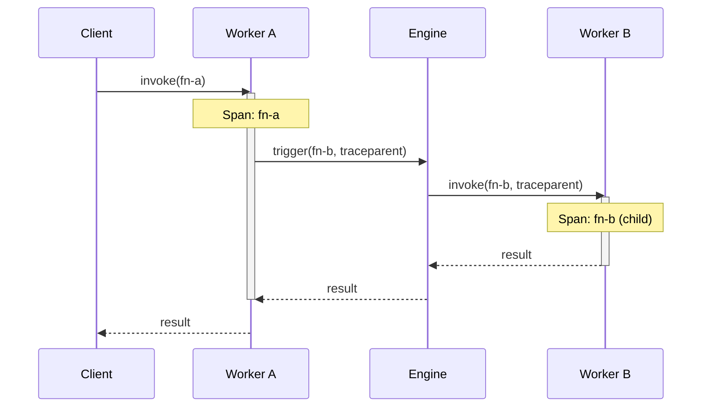

The iii SDK ships with built-in OpenTelemetry (OTel) support across all three SDKs (Node.js, Python, Rust). Every function invocation is automatically traced, worker metrics are collected, and structured logs are forwarded to the engine — all using the standard OTLP protocol.

## Data Flow



## Auto-Instrumentation

<Info title="Enabled by default">
  All three SDKs initialize OpenTelemetry automatically when you call `registerWorker()` / `register_worker()` with an `otel` config. A manual `init_otel()` is also available but is not required for typical usage.
</Info>

To disable auto-instrumentation in the Node.js SDK, set the environment variable `OTEL_ENABLED=false` or pass the option directly:

```typescript
const iii = registerWorker('ws://localhost:49134', {
  otel: { enabled: false },
})
```

## Configuration

<Tabs>
  <Tab title="Node / TypeScript">

```typescript
import { registerWorker } from 'iii-sdk'

const iii = registerWorker('ws://localhost:49134', {
  otel: {
    enabled: true,
    serviceName: 'my-service',
  },
})
```

  </Tab>
  <Tab title="Python">

```python
from iii import InitOptions, register_worker
from iii.telemetry_types import OtelConfig

iii = register_worker(
    address="ws://localhost:49134",
    options=InitOptions(
        otel=OtelConfig(
            enabled=True,
            service_name="my-service",
        ),
    ),
)
```

  </Tab>
  <Tab title="Rust">

```rust
use iii_sdk::{InitOptions, OtelOptions, register_worker};

let iii = register_worker(
    "ws://localhost:49134",
    InitOptions {
        otel: Some(OtelOptions {
            enabled: true,
            service_name: "my-service".into(),
            description: None, request_format: None, response_format: None, metadata: None, invocation: None
        }),
        description: None, request_format: None, response_format: None, metadata: None, invocation: None
    },
)?;
```

  </Tab>
</Tabs>

## Traces

Every function invocation creates a span automatically. Cross-worker calls propagate trace context via `traceparent` and `baggage` headers, so a single request that fans out across multiple workers appears as a unified trace.



### Custom Spans

Use `withSpan` to create custom spans within a function handler:

<Tabs>
  <Tab title="Node / TypeScript">

```typescript
import { withSpan } from 'iii-sdk/telemetry'

iii.registerFunction({ id: 'orders::process' }, async (data) => {
  return withSpan('validate-order', {}, async (span) => {
    span.setAttribute('order.id', data.orderId)
    const valid = await validateOrder(data)
    span.setAttribute('order.valid', valid)
    return { status_code: 200, body: { valid } }
  })
})
```

  </Tab>
  <Tab title="Python">

```python
from iii.telemetry import with_span

async def process_order(data):
    async def validate(span):
        span.set_attribute("order.id", data["orderId"])
        valid = await validate_order(data)
        span.set_attribute("order.valid", valid)
        return {"status_code": 200, "body": {"valid": valid}}

    return await with_span("validate-order", validate)
```

  </Tab>
  <Tab title="Rust">

```rust
use iii_sdk::{telemetry::with_span, RegisterFunctionMessage};

iii.register_function((RegisterFunctionMessage::with_id("orders::process".into()), |input| async move {
    with_span("validate-order", |span| async move {
        span.set_attribute("order.id", input["orderId"].as_str().unwrap_or_default()));

        let valid = validate_order(&input).await?;
        span.set_attribute("order.valid", valid);
        Ok(json!({ "status_code": 200, "body": { "valid": valid } }))
    }).await
});
```

  </Tab>
</Tabs>

## Metrics

Worker metrics (CPU, memory, event loop latency) are reported via `WorkerMetricsCollector`. Metrics reporting is enabled by default through the `enableMetricsReporting: true` option.

<Tabs>
  <Tab title="Node / TypeScript">

```typescript
const iii = registerWorker('ws://localhost:49134', {
  enableMetricsReporting: true,
})
```

  </Tab>
  <Tab title="Python">

```python
iii = register_worker(
    address="ws://localhost:49134",
    options=InitOptions(enable_metrics_reporting=True),
)
```

  </Tab>
  <Tab title="Rust">

```rust
let iii = III::builder("ws://localhost:49134")
    .enable_metrics_reporting(true)
    .build();
```

  </Tab>
</Tabs>

The following worker metrics are collected automatically via observable gauges:

| Metric | Type | SDKs | Description |
|--------|------|------|-------------|
| `iii.worker.cpu.percent` | Observable Gauge | Node.js, Python | Worker CPU utilization percentage |
| `iii.worker.cpu.user_micros` | Observable Gauge | Node.js, Python | CPU user time in microseconds |
| `iii.worker.cpu.system_micros` | Observable Gauge | Node.js, Python | CPU system time in microseconds |
| `iii.worker.memory.rss` | Observable Gauge | Node.js, Python | Resident set size in bytes |
| `iii.worker.memory.vms` | Observable Gauge | Python only | Virtual memory size in bytes |
| `iii.worker.memory.heap_used` | Observable Gauge | Node.js, Python | Heap memory used in bytes |
| `iii.worker.memory.heap_total` | Observable Gauge | Node.js, Python | Total heap memory in bytes |
| `iii.worker.memory.external` | Observable Gauge | Node.js, Python | External memory in bytes (always 0 in Python) |
| `iii.worker.uptime_seconds` | Observable Gauge | Node.js, Python | Worker uptime in seconds |
| `iii.worker.event_loop.lag_ms` | Observable Gauge | Node.js only | Event loop lag in milliseconds |

<Info title="Engine-level invocation metrics">
  Invocation metrics (`iii.invocations.total`, `iii.invocation.duration`, `iii.invocation.errors.total`) are collected by the iii Engine, not by the worker SDKs. They are available regardless of which SDK language you use.
</Info>

## Logs

Subscribe to OpenTelemetry log events from the engine using `onLog()`. Logs include severity level, body text, and resource attributes.

<Tabs>
  <Tab title="Node / TypeScript">

```typescript
import { registerWorker } from 'iii-sdk'

const iii = registerWorker('ws://localhost:49134')

iii.onLog((log) => {
  console.log(`[${log.severity_text}] ${log.body}`)
}, { level: 'warn' })
```

  </Tab>
  <Tab title="Python">

```python
from iii.telemetry import get_logger

logger = get_logger()

if logger:
    logger.emit(
        opentelemetry.sdk._logs.LogRecord(
            body="Order processed successfully",
        )
    )
```

  </Tab>
  <Tab title="Rust">

```rust
use iii_sdk::telemetry::get_logger_provider;
use opentelemetry::logs::{Logger, LogRecord, Severity};

if let Some(provider) = get_logger_provider() {
    let logger = provider.logger("my-service");
    let mut record = LogRecord::default();
    record.set_severity_number(Severity::Info);
    record.set_body("Order processed successfully".into());
    logger.emit(record);
}
```

  </Tab>
</Tabs>

## Telemetry Utilities

The `iii-sdk/telemetry` subpath (Node.js) and `iii.telemetry` module (Python) export the following utilities:

| Node.js (camelCase) | Python (snake_case) | Description |
|---------------------|---------------------|-------------|
| `getTracer()` | `get_tracer()` | Returns the OTel `Tracer` instance for creating custom spans |
| `getMeter()` | `get_meter()` | Returns the OTel `Meter` instance for creating custom metrics |
| `getLogger()` | `get_logger()` | Returns the OTel `Logger` instance for structured log emission |
| `withSpan(name, opts, fn)` | `await with_span(name, fn)` | Wraps an async function in a custom span |
| `currentTraceId()` | `current_trace_id()` | Returns the active trace ID for log correlation |
| `currentSpanId()` | `current_span_id()` | Returns the active span ID for log correlation |
| `initOtel(config)` | `init_otel(config)` | Manually initialize OTel (Python and Rust) |
| `shutdownOtel()` | `shutdown_otel()` | Flush pending telemetry and shut down the OTel SDK |

### Python imports

```python
from iii.telemetry import (
    with_span,
    get_tracer,
    get_meter,
    get_logger,
    current_trace_id,
    current_span_id,
    init_otel,
    shutdown_otel,
    shutdown_otel_async,
)
from iii.telemetry_types import OtelConfig
```

<Warning title="Graceful shutdown">
  Always call `shutdown_otel()` / `shutdownOtel()` (or `iii.shutdown()`) before your process exits to ensure all buffered spans, metrics, and logs are flushed. The Python SDK also provides `shutdown_otel_async()` for use within async contexts.
</Warning>

## Cross-SDK Comparison

| Feature | Node.js | Python | Rust |
|---------|---------|--------|------|
| Auto-init | Yes (on `registerWorker()`) | Yes (on `register_worker()`) | Manual (`init_otel()`) |
| Trace propagation | Automatic | Automatic | Automatic |
| Worker metrics | Built-in | Built-in | Built-in |
| Log emission | OTel `Logger` via `getLogger()` | OTel `Logger` via `get_logger()` | OTel `Logger` |

## Environment Variables

Configure OpenTelemetry without code changes using standard OTel environment variables:

| Variable | Default | SDKs | Description |
|----------|---------|------|-------------|
| `OTEL_ENABLED` | `true` | Node.js, Python | Enable or disable OpenTelemetry (Python accepts `false`, `0`, `no`, `off`) |
| `OTEL_SERVICE_NAME` | Worker name | Node.js, Python | Override the service name reported to the collector |
| `III_URL` | `ws://localhost:49134` | Python | III Engine WebSocket URL for the span/log/metrics exporter |

<Info title="Precedence">
  Programmatic configuration passed to `registerWorker()` / `register_worker()` via `OtelConfig` takes precedence over environment variables. Environment variables take precedence over defaults.
</Info>

<Warning title="Python SDK does not use OTEL_EXPORTER_OTLP_ENDPOINT">
  The Python SDK sends telemetry directly to the iii Engine over WebSocket using `engine_ws_url` (or `III_URL`), not to a standalone OTLP collector endpoint. The `OTEL_EXPORTER_OTLP_ENDPOINT` variable has no effect in the Python SDK.
</Warning>

## Next Steps

<CardGroup cols={2}>
  <Card title="Deployment" href="/advanced/deployment">
    Production deployment with observability infrastructure
  </Card>
</CardGroup>
