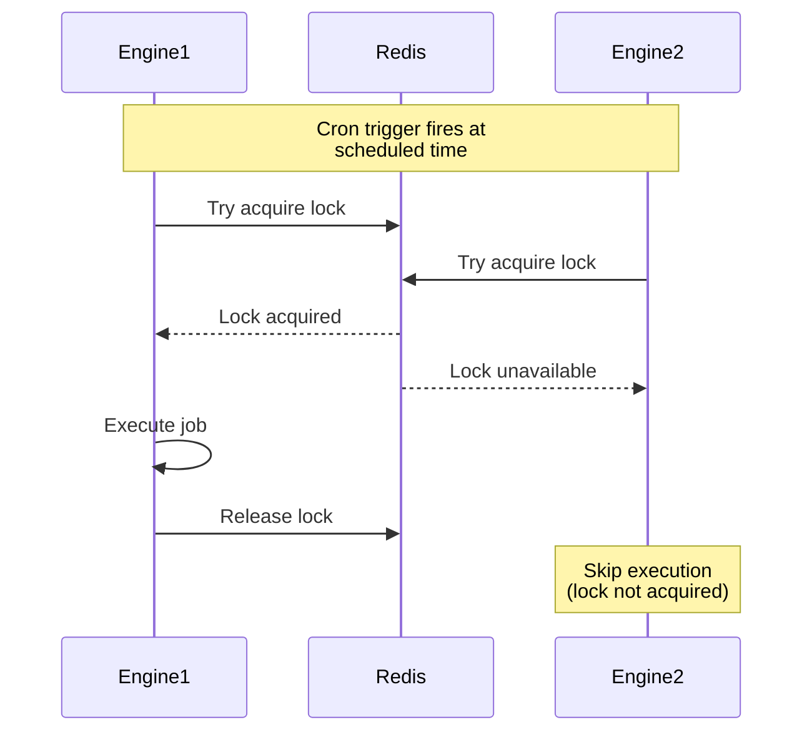

Schedule functions to execute at specific times using cron expressions.

```
modules::cron::CronModule
```

## Sample Configuration

```yaml
- class: modules::cron::CronModule
  config:
    adapter:
      class: modules::cron::RedisCronAdapter
      config:
        redis_url: ${REDIS_URL:redis://localhost:6379}
```

## Configuration

<ResponseField name="adapter" type="Adapter">
  The adapter to use for distributed locking. Defaults to `modules::cron::KvCronAdapter`. Use `RedisCronAdapter` for multi-instance deployments.
</ResponseField>

## Adapters

### modules::cron::KvCronAdapter

<Warning>
  When running multiple engine instances, `KvCronAdapter` does not provide reliable distributed locking — the same cron job may execute on every instance simultaneously. Use `RedisCronAdapter` for multi-instance deployments.
</Warning>

Built-in adapter using process-local locks. Suitable for single-instance deployments.

```yaml
class: modules::cron::KvCronAdapter
config:
  lock_ttl_ms: 30000
  lock_index: cron_locks
```

#### Configuration

<ResponseField name="lock_ttl_ms" type="integer">
  Duration in milliseconds for which a lock is held before it expires. Defaults to `30000` (30 seconds).
</ResponseField>
<ResponseField name="lock_index" type="string">
  Key namespace used to store lock entries in the KV store. Defaults to `cron_locks`.
</ResponseField>

### modules::cron::RedisCronAdapter

Uses Redis for distributed locking to prevent duplicate job execution across multiple engine instances.

```yaml
class: modules::cron::RedisCronAdapter
config:
  redis_url: ${REDIS_URL:redis://localhost:6379}
```

#### Configuration

<ResponseField name="redis_url" type="string">
  The URL of the Redis instance to use for distributed locking.
</ResponseField>

## Trigger Type

This Module adds a new Trigger Type: `cron`.

<Expandable title="Trigger Config">
  <ResponseField name="expression" type="string" required>
    Standard cron expression defining the schedule. Supports the following format:

    ```
    * * * * * *
    │ │ │ │ │ │
    │ │ │ │ │ └─── Day of week (0–6, Sun=0)
    │ │ │ │ └───── Month (1–12)
    │ │ │ └─────── Day of month (1–31)
    │ │ └───────── Hour (0–23)
    │ └─────────── Minute (0–59)
    └─────────── Second (0–59)
    ```

  </ResponseField>
  <ResponseField name="condition_function_id" type="string">
    Function ID for conditional execution. The engine invokes it with the cron event; if it returns `false`, the handler function is not called.
  </ResponseField>
</Expandable>

<Expandable title="Trigger Event Payload">
  The following fields are passed to the handler function (and to `condition_function_id` if set) each time the trigger fires.

  <ResponseField name="trigger" type="string">
    Always `"cron"`.
  </ResponseField>
  <ResponseField name="job_id" type="string">
    The ID of the cron trigger that fired.
  </ResponseField>
  <ResponseField name="scheduled_time" type="string">
    The time the job was scheduled to run, in RFC 3339 format.
  </ResponseField>
  <ResponseField name="actual_time" type="string">
    The actual time the job began executing, in RFC 3339 format.
  </ResponseField>
</Expandable>

### Sample Code

<Tabs>
<Tab title="TypeScript">
```typescript
const fn = iii.registerFunction(
  { id: 'jobs::cleanupOldData' },
  async (event) => {
    console.log('Running cleanup scheduled at:', event.scheduled_time)
    return {}
  },
)

iii.registerTrigger({
  type: 'cron',
  function_id: fn.id,
  config: { expression: '0 0 2 * * *' },
})
```
</Tab>
<Tab title="Python">
```python
def cleanup_old_data(event):
    print('Running cleanup scheduled at:', event['scheduled_time'])
    return {}

iii.register_function({'id': 'jobs::cleanupOldData'}, cleanup_old_data)
iii.register_trigger({'type': 'cron', 'function_id': 'jobs::cleanupOldData', 'config': {'expression': '0 0 2 * * *'}})
```
</Tab>
<Tab title="Rust">
```rust
iii.register_function(
    RegisterFunctionMessage::with_id("jobs::cleanupOldData".into()),
    |event: Value| async move {
        println!("Running cleanup scheduled at: {}", event["scheduled_time"]);
        Ok(json!({}))
    },
);

iii.register_trigger(RegisterTriggerInput {
    trigger_type: "cron".into(),
    function_id: "jobs::cleanupOldData".into(),
    config: json!({ "expression": "0 0 2 * * *" }),
})?;
```
</Tab>
</Tabs>

## Common Cron Expressions

| Expression           | Description                                    |
| -------------------- | ---------------------------------------------- |
| `0 * * * * *`        | Every minute                                   |
| `0 0 * * * *`        | Every hour                                     |
| `0 0 0 * * *`        | Every day at midnight                          |
| `0 0 0 * * 0`        | Every Sunday at midnight                       |
| `0 0 2 * * *`        | Every day at 2 AM                              |
| `0 */5 * * * *`      | Every 5 minutes                                |
| `0 0 9-17 * * 1-5`   | Every hour from 9 AM to 5 PM, Monday to Friday |

## Distributed Execution

When running multiple iii Engine instances, the Cron Module uses distributed locking to ensure jobs execute only once:


